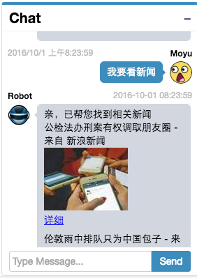

# React-Chat

- See



- Get Start
```sh
# dev mode
npm install
npm run dev

# production
npm run build
open build/index.html
```

- Directory Tree

```sh
react-chat/
├── app/ # dev files about react.
│   ├── common/
│   ├── component/
│   │   ├── App.js
│   │   └── Message.js
│   ├── css/
│   │   ├── base.less
│   │   └── mixin.less
│   └── main.js
├── build/ # built by webpack from app
│   ├── css/
│   │   ├── font-awesome.css
│   │   ├── font-awesome.css.map
│   │   └── font-awesome.min.css
│   ├── fonts/
│   │   ├── fontawesome-webfont.eot
│   │   ├── fontawesome-webfont.svg
│   │   ├── fontawesome-webfont.ttf
│   │   ├── fontawesome-webfont.woff
│   │   ├── fontawesome-webfont.woff2
│   │   └── FontAwesome.otf
│   ├── index.html
│   └── main.js
├── index.js # web-dev-server run
├── package.json
├── README.md
└── webpack.config.js

```